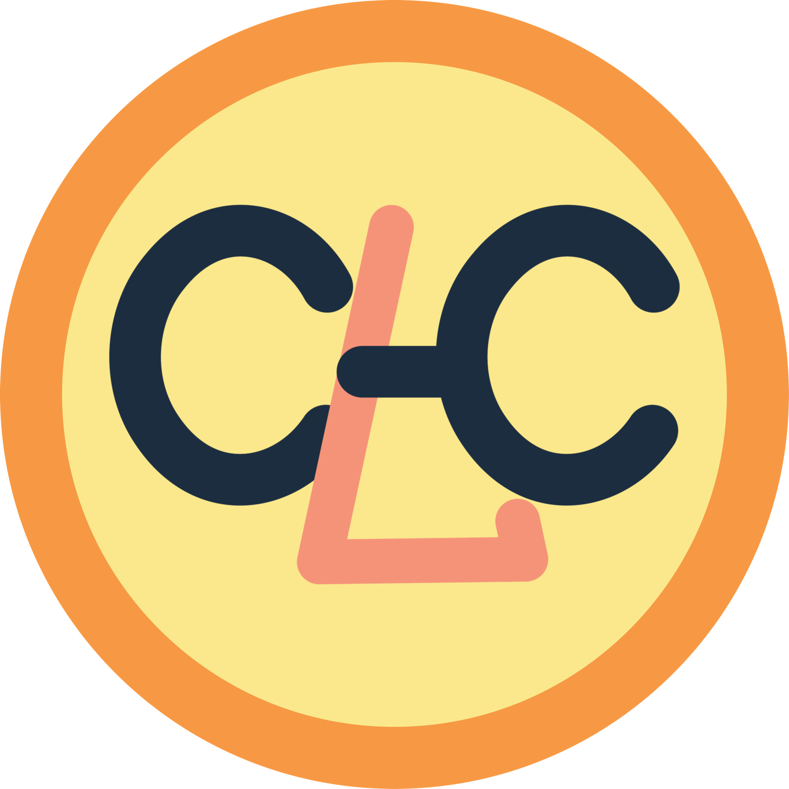

# HoudiniTools

## About
 **HoudiniTools** is a repository of the HDAs and Shelf tools I created. 
 I am still working on updating the tools, documentations, and setup the 
 repository for downloads. However, feel free to download them and try it out!

## Tools
### LOPs
- `my_megascan_component_builder`: Import Megascan asset from SOP to LOP, save it as an USD asset,
and adds it into Layout Asset Library.
### SOPs
- `my_arrow`: Creates an arrow geometry.
- `my_breakdown_tool`: Animates geometry for breakdown.
- `my_normal_paint_tool`: Bakes out normal map to use in render to create a paint or clay-like effect
- `my_rock_generator`: A procedural rock generator.
- `my_smooth_fluid_surface`: Smooths fluid mesh based on velocity attribute.
- `my_wetmap_simulator`: Simulates and bake out a wet map texture map.
### TOPs
- `discord_send_message`: Sends message to user through a discord bot.
- `discord_tracker_begin`: Initializes the track begin tracking the TOP net that is cooking.
- `discord_tracker_end`: Retrieves the final tracked cooking result.
- `discord_tracker`: Updates tracking message send from the `discord_tracker_begin` node.
- `my_ffmpeg_image_to_video`: Uses OS command to run ffmepg to convert image sequence to video.
### Shelf Tools
- `megascan_asset_builder`: Brings imported Megascan assets from SOP to Stage using the `megascan_component_builder`.
- `discord_tracker_quick_setup`: Sets up the discord trackers from selected nodes in TOP net.

## Installation
1. Download the HDAs you want to try out.
2. Move the HDAs you want to try out into the otls folder in your Houdini preference folder.

## Documentations
I am still working on adding documentations and organizing the tools, but you can check out some 
[**blogs**](https://kylelinvfx.com/category/all/tool/) about the some of the tools on 
[**my website**](https://kylelinvfx.com) where I explained how the tool works.